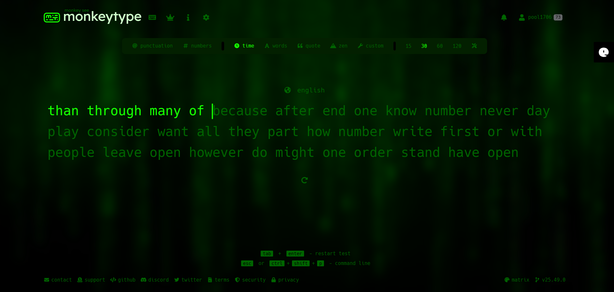
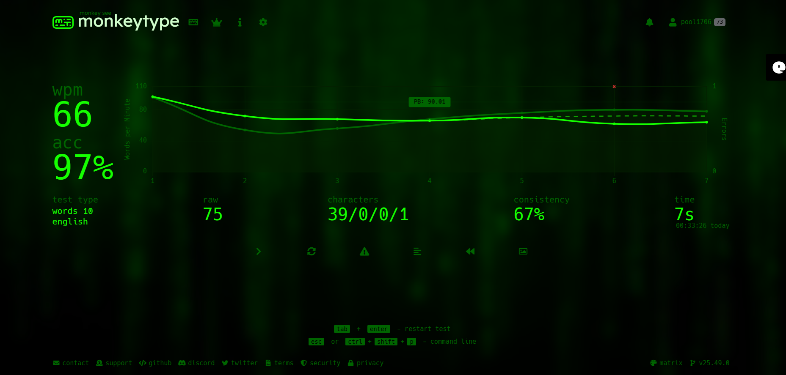

# Monkeytype Themes Collection

---
### HOW TO USE

#### Copy the JSON and import manually
1. **Copy the json file code** from the theme.json file for the theme you wish to import
2. Open Monkeytype → **Settings → Danger zone → Import or export the settings as JSON → Import → then PASTE THE CODE**
3. The theme, including the background, will load automatically  

---

## 1) the blue glow - [theme1.json](theme1.json)

### Preview
Here’s how the theme looks:

### JSON file for the above theme: [theme1.json](theme1.json)

---

## 2) matrix - [matrixtheme.json](matrixtheme.json)

### Preview
Here’s how the theme looks:

### JSON file for the above theme: [matrixtheme.json](matrixtheme.json)

---

### Author
Sujnan P
