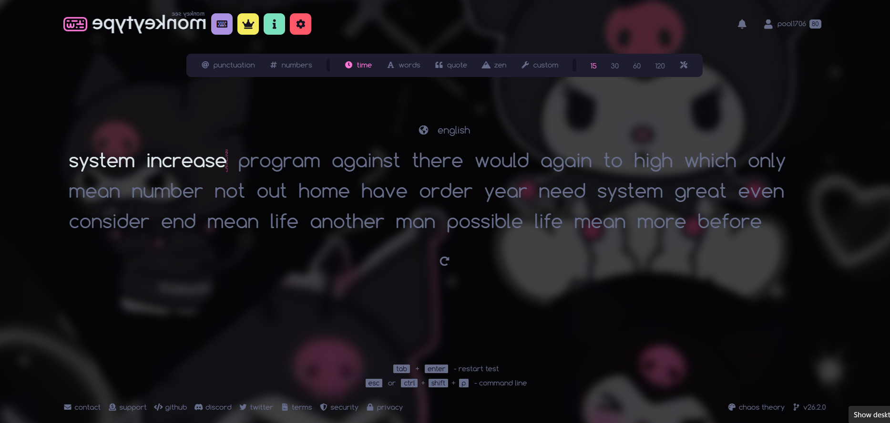
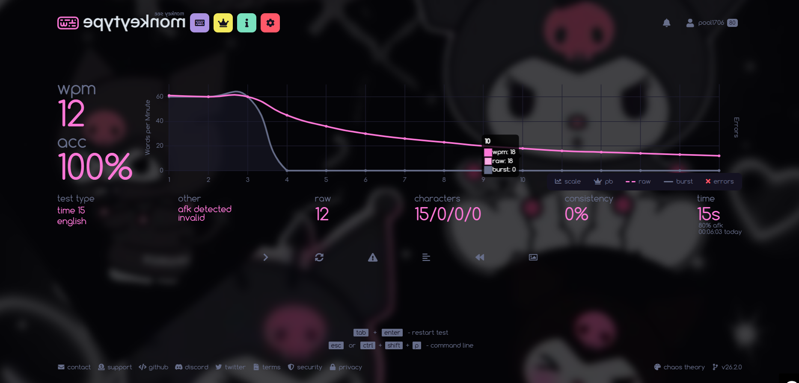

# Monkeytype Themes Collection

---
### HOW TO USE

#### Copy the JSON and import manually
1. **Copy the json file code** from the theme.json file for the theme you wish to import
2. Open Monkeytype → **Settings → Danger zone → Import or export the settings as JSON → Import → then PASTE THE CODE**
3. The theme, including the background, will load automatically

**Note:** If you already have a background image set in Monkeytype, remove it before importing this theme.  
Theme -> custom background -> remove image

---

## 1) the blue glow - [theme1.json](theme1.json)

### Preview
Here’s how the theme looks:

### JSON file for the above theme: [theme1.json](theme1.json)

---

## 2) Totoro - [totoro.json](totoro.json)

### Preview
Here’s how the theme looks:

### JSON file for the above theme: [totoro.json](totoro.json)

---
## 3) Kuromi - [kuromi.json](kuromi.json)

### Preview
Here’s how the theme looks:

### JSON file for the above theme: [kuromi.json](kuromi.json)

---
### Author
Sujnan P
